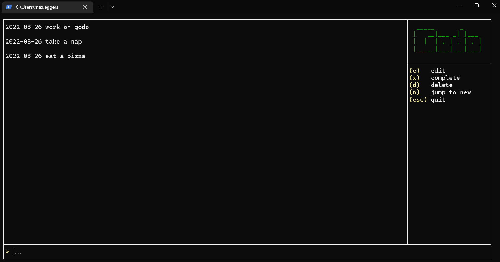

 

# Godo

Godo is a simple terminal UI todo app written in Go.

## Installation

Download the executable for your system from the [latest release](https://github.com/meggers/godo/releases/latest), ensure it is in your system's PATH.

## Usage

See the [User Guide](./docs/user-guide.md)

## Contributing
Pull requests are welcome. For major changes, please open an issue first to discuss what you would like to change.

Please make sure to update tests as appropriate.

See the [Developer Guide](./docs/developer-guide.md)

## License
[MIT](https://choosealicense.com/licenses/mit/)